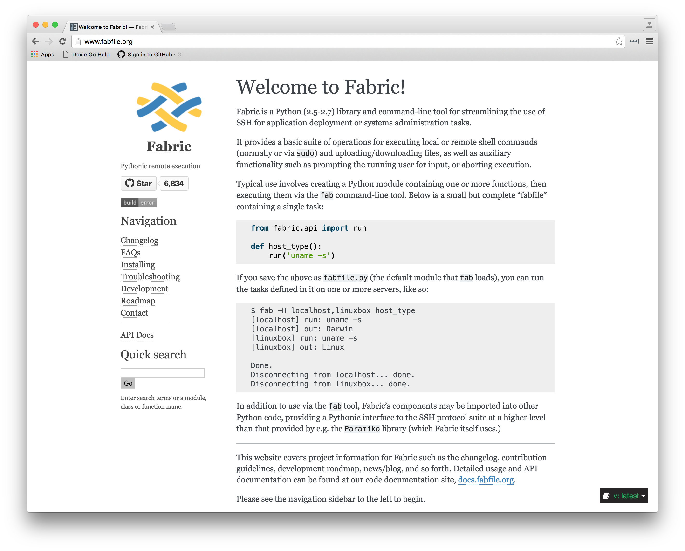

footer: Rich Burroughs @richburroughs

## Fabric and Puppet

### Rich Burroughs

---

## What is Fabric?

---



---

> Fabric is a Python…library and command-line tool for streamlining the use of SSH for application deployment or systems administration tasks.
-- fabfile.org

---

### library and command-line tool

---

### application deployment or systems administration tasks

---

### orchestration + remote execution

---

### Similar to Ansible and Capistrano

^ Ansible is popular, supports facts

---

### Why Fabric?

^ ease of use
^ only requires sshd and Python on your laptop
^ extensible - writing Python code
^ out of band of your Puppet infrastructure


---

### Why not mcollective?

^ it has to be installed
^ middleware can hose up
^ sshd is everywhere
^ puppet labs even heading in a different direction

---

### Fabric functions AKA Operations

---

### run sudo local get put reboot

---

``` Python
    def deploy():
        local('git push')
        run('git pull')
        sudo('puppet agent -t')
```

---

### functions are building blocks

---

### tasks

---

``` Python
    @task
    def foo():
        sudo('foo')
```

---

### fabfiles

---

### env

---

### fab command

---

### authentication

---

### roles

---
