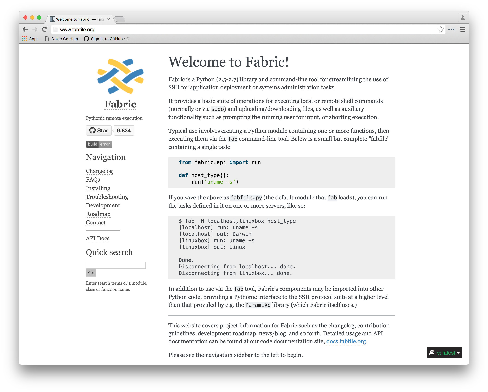

footer: Rich Burroughs @richburroughs

## Fabric and Puppet

### Rich Burroughs

---

## What is Fabric?

---

---

> Fabric is a Python…library and command-line tool for streamlining the use of SSH for application deployment or systems administration tasks.
-- fabfile.org

---

## orchestration + remote execution

---

## Similar to Ansible and Capistrano

---

## Why Fabric?

^ ease of use
^ only requires sshd and Python on your laptop
^ extensible - writing Python code
^ out of band of your Puppet infrastructure

---

## Why not mcollective?

---
